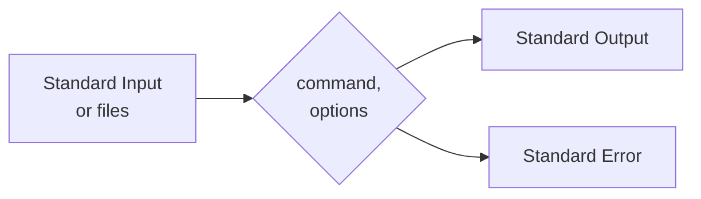

## Chapter 1: UNIX for Beginners

What is UNIX?
In the narrowest sense, it is a time-sharing operating system *kernel*: a program that controls the resources of a computer and allocates them among its users.
It lets users run their programs; it controls the peripheral devices (discs, terminals, printers, and the like) connected to the machine; and it provides a file system that manages there long-term storage of information such as programs, data, and documents.

In a broader sense, UNIX is often taken to include not only the kernel, but also essential programs like compilers, editors, command languages, programs for copying and printing files, and so on.

Still bore broadly, UNIX may even include programs developed by you or other users to be run on your system, such as tools for document preparation, routines for statistical analysis, and graphics packages.

Which of these uses of the name UNIX is correct depends on which level of the system you are considering.
When we use UNIX in the rest of this book, context should indicate which meaning is implied.

The UNIX system sometimes looks more difficult than it is - it's hard for a newcomer to know how to make the best use of the facilities available.
But fortunately it's not hard to get started - knowledge of only a few programs should get you off the ground.
This chapter is meant to help you to start using the system as quickly is possible.
It's an overview, not a manual; we'll cover most of the material again in more detail in later chapters.
We'll talk about these major areas:
- basics
  - logging in and out
  - simple commands
  - correcting typing mistakes
  - mail
  - inter-terminal communication
- day-to-day use
  - files and the file system
  - printing files
  - directories
  - commonly-used commands
- the command interpreter or *shell*
  - filename shorthands
  - redirecting input and output
  - pipes
  - setting erase and kill characters
  - defining your own search path for commands
If you've used a UNIX system before, most of this chapter should be familiar; you might want to skip straight to Chapter 2.

You will need a copy of the *UNIX Programmer's Manual*, even as you read this chapter; it's often easier for us to tell you to read about something in the manual than to repeat it's contents here.
This book is not supposed to replace it, but to show you how to make best use of the commands described in it.
Furthermore, there may be differences between what we say here and what is true on your system.
The manual has a permuted index at the beginning that's indispensable for finding the right programs to apply to a problem; learn to use it.

Finally, a word of advice: don't be afraid to experiment.
If you are a beginner, there are very few accidental things you can do to hurt yourself or other users.
So learn how things work by trying them.
This is a long chapter, and the best way to read it is a few pages at a time, trying things out as you go.

### 1.1 Getting started

#### Some prerequisites about terminals

To avoid explaining everything about using computers, we must assume you have some familiarity with computer terminals and how to use them.
If any of the following statements are mystifying, you should ask a local expert for help.

The UNIX system is *full duplex*: the characters you type on the keyboard are sent to the system, which sends them back to the terminal to be printed on the screen.
Normally, this *echo* process copies the characters directly to the screen, so you can see what you are typing, but sometimes, such as when you are typing a secret password, the echo is turned off so the characters do not appear on the screen.

Most of the keyboard characters are ordinary printing characters with no special significance, but a few tell the computer how to interpret your typing.
By far the most important of these is the RETURN key.
The RETURN key signifies the end of a line of input; the system echoes it by moving the terminal's cursor to the beginning of the line on the screen.
RETURN must be pressed before the system will interpret the characters you have typed.

RETURN is an example of a *control character* - an invisible character that controls some aspect of input and output on the terminal.
On any reasonable terminal, RETURN has a key of its own, but most control characters do not.
Instead, they must be typed by holding down the CONTROL key, sometimes called CTL or CNTL or CTRL, then pressing another key, usually a letter.
For example, RETURN may be typed by pressing down the RETURN key or, equivalently, holding down the CONTROL key and typing an 'm'.
RETURN might therefore be called a control-m, which we will write as `ctl-m`.
Other control characters include `ctl-d`, which tells a program that there is no more input; `ctl-g`, which rings the bell on the terminal; `ctl-h`, often called backspace, which can be used to correct typing mistakes; and `ctl-i`, often called tab, which advances the cursor to the next tab stop, much as on a regular typewriter.
Tab stops on UNIX systems are eight spaces apart.
Both the backspace and tab characters have their own keys on most terminals.

Two other keys have special meaning: DELETE, sometimes called RUBOUT or some abbreviation, and BREAK, sometimes called INTERRUPT.
On most UNIX systems, the DELETE key stops a program immediately, without waiting for it to finish.
On some systems, `ctl-c` provides this service.
And on some systems, depending on how the terminals are connected, BREAK is a synonym for DELETE or `ctl-c`.

#### A Session with UNIX

Let's begin with an annotated dialog between you and your UNIX system.
Throughout the examples in this book, what you type is printed in *`slanted letters`*, computer responses are in `typewriter-style characters`, and explanations are in *italics*.

```
Establish a connection: dial a phone or turn on a switch as necessary.
Your system should say
login: you
Password: 
You have mail.
$
$
$ date
Sun Sep 25 23:02:57 EDT 1983
$ who
jlb        tty0        Sep 25 13:59
you        tty2        Sep 25 23:01
mary       tty4        Sep 25 19:03
doug       tty5        Sep 25 19:22
egb        tty7        Sep 25 17:17
bob        tty8        Sep 25 20:48
$ mail
From doug Sun Sep 25 20:53 EDT 1983
give me a call sometime monday

?
From mary Sun Sep 25 19:07 EDT 1983
Lunch at noon tomorrow?

? d
$
$ mail mary
lunch at 12 is fine
ctl-d
$
```

Sometimes that's all there is to a session, though occasionally people do some work too.
The rest of this section will discuss the session above, plus other programs that make it possible to do useful things.

#### Logging in

You must have a login name and password, which you can get from your system administrator.
The UNIX system is capable of dealing with a wide variety of terminals, but it is strongly oriented towards devices with *lower case*; case distinctions matter!
If your terminal produces only upper case (like some video and portable terminals), life will be so difficult that you should look for another terminal.

Be sure the switches are set appropriately on your device, upper and lower case, full duplex, and any other settings that local experts advise, such as the speed, or *baud rate*.
Establish a connection using whatever magic is needed for your terminal; this may involve dialing a telephone or merely flipping a switch.
In either case, the system should type
```
login:
```
If it types garbage, you may be at the wrong speed; check the speed setting and other switches.
If that fails, press the BREAK or INTERRUPT key a few times, slowly.
If nothing produces a login message, you will have to get help.

When you get to the `login:` message, type your login name *in lower case*.
Follow it by pressing RETURN.
If a password is required, you will be asked for it, and printing will be turned off while you type it.

The culmination of your login efforts is a *prompt*, usually a single character, indicating that the system is ready to accept commands from you.
The prompt is most likely to be a dollar sign `$` or a percent sign `%`, but you can change it to anything you like; we'll show you how a little later.
The prompt is actually printed by a program called the *command interpreter* or *shell*, which is your main interface to the system.

There may be a message of the day just before the prompt, or a notification that you have mail.
You may also be asked what kind of terminal you are using; your answer helps the system to use any special properties the terminal might have.

#### Typing commands

Once you receive the prompt, you can type *commands*, which are requests that the system do something.
We will use *program* as a synonym for command.
When you see the prompt (let's assume it's `$`), type `date` and press RETURN.
The system should reply with the date and time, then print another prompt, so the whole transaction will look like this on your terminal:
```
$ date
Mon Sep 26 12:20:57 EDT 1983
$
```
Don't forget RETURN, and don't type the `$`.
If you think you're being ignored, press RETURN; something should happen.
RETURN won't be mentioned again, but you need it at the end of every line.

The next command to try is `who`, which tells you everyone who is currently logged in:
```
$ who
rlm        tty0        Sep 25 11:17
pjw        tty4        Sep 25 11:30
gerard     tty7        Sep 25 10:27
mark       tty9        Sep 25 07:59
you        ttya        Sep 25 12:20
```
The first column is the user name.
The second is the system's name for the connection being used ("tty" stands for "teletype", an archaic synonym for "terminal").
The rest tells when the user logged on.
You might also try:
```
$ whoami
you        ttya        Sep 25 12:20
```

If you make a mistake typing the name of a command, and refer to a nonexistent command, you will be told that no command of that name can be found:
```
$ whom
whom: not found
$
```
Of course, if you inadvertently type the name of an actual command, it will run, perhaps with mysterious results.

#### Strange terminal behavior

Sometimes your terminal will act strangely, for example, each letter may be typed twice, or RETURN may not put the cursor at the first column of the next line.
You can usually fix this by turning the terminal off and on, or by logging out and logging back in.
Or you can read the description of the command `stty` ("set terminal options") in Section 1 of the manual.
To get intelligent treatment of tab characters if your terminal doesn't have tabs, type the command
```
$ stty -tabs
```
and the system will convert tabs into the right number of spaces.
If your terminal does have computer-settable tab stops, the command `tabs` will set them correctly for you.
(You may actually have to say
```
$ tabs terminal-type
```
to make it work - see the `tabs` command description in the manual.)

#### Mistakes in typing

If you make a typing mistake, and see it before you have pressed RETURN, there are two ways to recover: *erase* characters one at a time or *kill* the whole line and re-type it.

If you type the *line kill* character, by default an at sign `@`, it causes the whole line to be discarded, just as if you'd never typed it, and starts you over on a new line:
```
$ ddtae@
date
Mon Sep 26 12:23:39 EDT 1983
```

The particular erase and line kill characters are *very* system dependent.
On many systems (including the one we use), the erase character has been changed to backspace, which works nicely on video terminals.
You can quickly check which is the case on your system:
```
$ datee⌫
datee⌫: not found
$ datee#
Mon Sep 26 12:26:08 EDT 1983
```
(We printed the backspace as ⌫ so you can see it.)
Another common choice is `ctl-u` for line kill.

We will use the sharp as the erase character for the rest of this section because it's visible, but make the mental adjustment if your system is different.
Later on, in "tailoring the environment," we will tell you how to set the erase and line kill characters to whatever you like, once and for all.

What if you must enter an erase or line kill character as part of the text?
If you precede either `#` or `@` by a backslash `\`, it loses its special meaning.
So to enter a `#` or `@`, type `\#` or `\@`.
The system may advance the terminal's cursor to the next line after your `@`, even if it was preceded by a backslash.
Don't worry - the at-sign has been recorded.

The backslash, sometimes called the *escape character*, is used extensively to indicate that the following character is in some way special.
To erase a backslash, you have to type two erase characters: `\##`.
Do you see why?

The characters you type are examined and interpreted by a sequence of programs before they reach their destination, and exactly how they are interpreted depends not only on where they end up but how they got there.

Every character you type is immediately echoed to the terminal, unless echoing is turned off, which is rare.
Until you press RETURN, the characters are held temporarily by the kernel, so typing mistakes can be corrected with the erase and line kill characters.
When an erase or line kill character is preceded by a backslash, the kernel discards the backslash and holds the following character without interpretation.

When you press RETURN, the characters being held are sent to the program that is reading from the terminal.
That program may in turn interpret the characters in special ways; for example, the shell turns off any special interpretation of a character if it is preceded by a backslash.
We'll come back to this in Chapter 3.
For now, you should remember that the kernel processes erase and line kill, and backslash only if it precedes erase or line kill; whatever characters are left after that may be interpreted by other programs as well.

#### Type-ahead

The kernel reads what you type as you type it, even if it's busy with something else, so you can type as fast as you want, whenever you want, even when some command is printing at you.
If you type while the system is printing, your input characters will appear intermixed with the other characters, but they will be stored away and interpreted in the correct order.
You can type commands one after another without waiting for them to finish or even to begin.

#### Stopping a program

You can stop most commands by typing the character DELETE.
The BREAK key found on most terminals may also work, although this is system dependent.
In a few programs, like text editors, DELETE stops whatever the program is doing but leaves you in that program.
Turning off the terminal or hanging up the phone will stop most programs.

If you just want output to pause, for example, to keep something critical from disappearing off the screen, type `ctl-s`.
The output will stop almost immediately; your program is suspended until you start it again.
When you want to resume, type `ctl-q`.

#### Logging out

The proper way to log out is to type `ctrl-d` instead of a command; this tells the shell that there is no more input.
(How this actually works will be explained in the next chapter.)
You can usually just turn off the terminal or hang up the phone, but whether this really logs you out depends on your system.

#### Mail

The system provides a postal system for communicating with other users, so some day when you log in, you will see this message
```
you have mail
```
before the first prompt.
To read your mail, type
```
$ mail
```
Your mail will be printed, one message at a time, most recent first.
After each item, `mail` waits for you to say what to do with it.
The two basic responses are `d`, which deletes the message, and RETURN, which does not (so it will still be there the next time you read your mail).
Other responses include `p` to reprint a message, `s` *filename* to save it in the file you named, and `q` to quit from `mail`.
(If you don't know what a file is, think of it as a place where you can store information under a name of your choice, and retrieve it later.
Files are the topic of Section 1.2 and indeed of much of this book.)

`mail` is one of those programs that is likely to differ from what we describe here; there are many variants.
Look in your manual for details.

Sending mail to someone is straightforward.
Suppose it is to go to the person with the login name `nico`. The easiest way is this:
```
$ mail nico
Now type in the text of the letter
on as many lines as you like ...
After the kast line of the letter
type a control-d
ctl-d
$
```
The `ctl-d` signals the end of the letter by telling the `mail` command that there is no more input.
If you change your mind half-way through composing the letter, press DELETE instead of `ctl-d`.
The half-formed letter will be stored in a file called `dead.letter` instead of being sent.

For practice, send mail to yourself, then type `mail` to read it.
(This isn't as aberrant as it might sound - it's a handy reminder mechanism.)

There are other ways to send mail - you can send a previously prepared letter, you can mail to a number of people all at once, and you may be able to send mail to people on other machines.
For more details see the description of the `mail` command in Section 1 of the *UNIX Programmer's Manual*.
Henceforth, we'll use the notation `mail`(1) to mean the page describing `mail` in Section 1 of the manual.
All of the commands discussed in this chapter are found in Section 1.

There may also be a calendar service (see `calendar`(1)); we'll show you in Chapter 4 how to set one up if it hasn't been done already.

#### Writing to other users

If your UNIX system has multiple users, someday, out of the blue, your terminal will print something like
```
Message from mary tty7...
```
accompanied by a startling beep.
Mary wants to write to you, but unless you take explicit action you won't be able to write back.
To respond, type 
```
$ write mary
```
This establishes a two-way communication path.
Now the lines that Mary types on her terminal will appear on yours and vice versa, although the path is slow, rather like talking to the moon.

If you are in the middle of something, you have to get to a state where you can type a command.
Normally, whatever program you are running has to stop or be stopped, but some programs, such as the editor and `write` itself, have a `!` command to escape temporarily to the shell - see Table 2 in Appendix 1.

The `write` command imposes no rules, so a protocol is needed to keep what you type from getting garbled up with what Mary types.
One convention is to take turns, ending each turn with `(o)`, which stands for "over," and to signal your intent to quit with `(oo)`, for "over and out."

#### News

Many UNIX systems provide a news service, to keep users abreast of interesting and not so interesting events.
Try typing
```
$ news
```
There is also a large network of UNIX systems that keep in tough through telephone calls; ask a local expert about `netnews` and USENET.

#### The manual

The *UNIX Programmer's Manual* describes most of what you need to know about the system.
Section 1 deals with commands, including those we discuss in this chapter.
Section 2 describes system calls, the subject of Chapter 7, and Section 6 has information about games.
The remaining sections talk about functions for use by C programmers, file formats, and system maintenance.
(The numbering of these sections varies from system to system.)
Don't forget the permuted index at the beginning; you can skim it quickly for commands that might be relevant to what you want to do.
There is also an introduction to the system that gives an overview of how things work.

Often the manual is kept on-line so that you can read it on your terminal.
If you get stuck on something, and can't find an expert to help, you can print any manual page on your terminal with the command `man command-name`.
Thus to read about the `who` command, type
```
$ man who
```
and, of course,
```
$ man man
```
tells about the `man` command.

#### Computer-aided instruction

Your system may have a command called `learn`, which provides computer-aided instruction on the file system and basic commands, the editor, document preparation, and even C programming.
Try
```
$ learn
```
If `learn` exists on your system, it will tell you what to do from there.
If that fails, you might also try `teach`.

#### Games

It's  not always admitted officially, but one of the best ways to get comfortable with a computer and a terminal is to play games.
The UNIX system comes with a modest supply of games, often supplemented locally.
Ask around, or see Section 6 of the manual.

### 1.2 Day-to-day use: files and common commands

Information in a UNIX system is stored in *files*, which are much like ordinary office files.
Each file has a name, contents, a place to keep it, and some administrative information such as who owns it and how big it is.
A file might contain a letter, or a list of names and addresses, or the source statements of a program, or data to be used by a program, or even programs in their executable form and other non-textual material.

The UNIX file system is organized so you can maintain your own personal files without interfering with files belonging to other people, and keep people from interfering with you too.
There are myriad programs that manipulate files, but for now, we will look at only the more frequently used ones.
Chapter 2 contains a systematic discussion of the file system, and introduces many of the other file-related commands.

#### Creating files - the editor

If you want to type a paper or letter or a program, how do you get the information stored in the machine?
Most of these tasks are done with a *text editor*, which is a program for storing and manipulating information in the computer.
Almost every UNIX system has a *screen editor*, an editor that takes advantage of modern terminals to display the effects of your editing changes in context as you make them.
Two of the most popular are `vi` and `emacs`.
We won't describe any specific screen editor here, however, partly because of typographic limitations, and partly because there is no standard one.

There is, however, an older editor called `ed` that is certain to be available on your system.
It takes no advantage of special terminal features, so it will work on any terminal.
It also forms the basis of other essential programs (including some screen editors), so it's worth learning eventually.
Appendix 1 contains a concise description.

No matter what editor you prefer, you'll have to learn it well enough to be able to create files.
We'll use `ed` here to make the discussion concrete, and to ensure that you can make our examples run on your system, but by all means use whatever editor you like best.

To use `ed` to create a file called `junk` with some text in it, do the following:
```
$ ed                            Invokes the text editor
a                               ed command to add text
now type in                     
whatever text you want ...
.                               Type a '.' by itself to stop adding text
w junk                          Write your text into a file called junk
39                              ed prints number of characters written
q                               Quit ed
$
```
The command `a` ("append") tells `ed` to start collecting text.
The "." that signals the end of the text must be typed at the beginning of a line by itself.
Don't forget it, for until it is typed, no other `ed` commands will be recognized - everything you type will be treated as text to be added.

The editor command `w` ("write") stores the information that you typed; `w junk` stores it in a file called `junk`.
The filename can be any word you like; we picked `junk` to suggest that this file isn't very important.

`ed` responds with the number of characters put in the file.
Until the `w` command, nothing is stored permanently, so if you hang up and go home the information is not stored in the file.
(If you hang up while editing, the data you were working on is saved in a file called `ed.hup`, which you can continue with at your next session.)
If the system crashes (i.e., stops unexpectedly because of software or hardware failure) while you are editing, your file will contain only what the last write command placed there.
But after `w` the information is recorded permanently; you can access it again later by typing
```
$ ed junk
```

Of course, you can edit the text you typed in, to correct spelling mistakes, change wording, rearrange paragraphs and the like.
When you're done, the `q` command ("quit") leaves the editor.

#### What files are out there?

Let's create two files, `junk` and `temp`, so we know what we have:
```
$ ed
a
To be or not to be
.
w junk
19
q
$ ed
a
That is the question.
.
w temp
22
q
$ 
```
The character counts from `ed` include the character at the end of each line, called *newline*, which is how the system represents RETURN.

The `ls` command lists the names (not contents) of files:
```
$ ls
junk temp
$
```
which are indeed the two files just created.
(There might be others as well that you didn't create yourself.)
The names are sorted into alphabetical order automatically.

`ls`, like most commands, has *options* that may be used to alter its default behavior.
Options follow the command name on the command line, and are usually made up of an initial minus sign (`-`) and a single letter meant to suggest the meaning.
For example, `ls -t` causes the files to be listed in "time" order: the order in which they were last changed, most recent first.
```
$ ls -t
temp
junk
$
```
The `-l` option gives a "long" listing that provides more information about each file:
```
$ls -l
total 2
-rw-r--r--  1 you          19 Sep 26 16:25 junk
-rw-r--r--  1 you          22 Sep 26 16:26 temp
```
`total 2` tells how many blocks of disk space the files occupy; a block is usually either 512 or 1024 characters.
The string `-rw-r--r--` tells who has permission to read and write the file; in this case, the owner (`you`) can read and write, but others can only read it.
The `1` that follows is the number of links to the file; ignore it until Chapter 2.
`you` is the owner of the file, that is, the person who created it.
`19` and `22` are the number of characters in the corresponding files, which agree with the numbers you got from `ed`.
The date and time tell when the file was last changed.

Options can be grouped: `ls -lt` gives the same data as `ls -l`, but sorted with most recent files first.
The `-u` option gives information on when files were used: `ls -lut` gives a long (`-l`) listing in the order of most recent use.
The option `-r` reverses the order of the output, so `ls -rt` lists in order of least recent use.
You can also name the files you're interested in, and `ls` will list the information about them only:
```
$ ls -l junk
-rw-r--r--  1 you          19 Sep 26 16:25 junk
$
```

The strings that follow the program name on the command line, such as `-l` and `junk` in the example above, are called the program's *arguments*.
Arguments are usually options or names of files to be used by the command.

Specifying options by a minus sign and a single letter, such as `-t` or the combined `-lt`, is a common convention.
In general, if a command accepts such optional arguments, they precede any filename arguments, but may otherwise appear in any order.
But UNIX programs are capricious in their treatment of multiple options.
For example, standard 7th Edition `ls` won't accept
```
$ ls -l -t
```
as a synonym for `ls -lt`, while other programs *require* multiple options to be separated.

As you learn more, you will find that there is little regularity or system to optional arguments.
Each command has its own idiosyncrasies, and its own choices of what letter means what (often different from the same function in other commands).
This unpredictable behavior is disconcerting and is often cited as a major flaw of the system.
Although the situation is improving - new versions often have more uniformity - all we can suggest is that you try to do better when you write your own programs, and in the meantime keep a copy of the manual handy.

#### Printing files - `cat`and `pr`

Now that you have some files, how do you look at their contents?
There are many programs to do that, probably more than are needed.
One possibility is to use the editor:
```
$ ed junk
19
1,$p
To be or not to be
q
$
```
`ed` begins by reporting the number of characters in `junk`; the command `1,$p` tells it to print all the lines in a file.
After you learn how to use the editor, you can be selective about the parts you print.

There are times when it's not feasible to use an editor for printing.
For example, there is a limit - several thousand lines - on how big a file `ed` can handle.
Furthermore, it will only print one file at a time, and sometimes you want to print several, one after another without pausing.
So here are a couple of alternatives.

First is `cat`, the simplest of all the printing commands.
`cat` prints the *contents* of all the files named by its arguments:
```
$ cat junk
To be or not to be
$ cat temp
That is the question.
$ cat junk temp
To be or not to be
That is the question.
```
The named file or files are catenated (hence the name `cat`) onto the terminal one after another with nothing between.
("Catenate" is a slightly obscure synonym for "concatenate")


#### Moving, copying, removing files - `mv`, `cp`, `rm`

Let's look at some other commands.
The first thing is to change the name of a file.
Renaming a file is done by "moving" it from one name to another, like this:
```
$ mv junk precious
```
This means that the file that used to be called `junk` is now called `precious`; the contents are unchanged.
When you run `ls` now, you will see a different list: `junk` is not there but `precious` is.
```
$ ls
precious
temp
$ cat junk
cat: can't open junk
$
```
Beware that if you move a file to another one that already exists, the target file is replaced.

To make a *copy* of a file (that is, to have two versions of something), use the `cp` command:
```
$ cp precious precious.save
```
makes a duplicate copy of `precious` in `precious.save`.

Finally, when you get tired of creating and moving files, the `rm` command removes all the files you name:
```
$ rm temp junk
rm: junk nonexistent
$
```
You will get a warning if one of the files to be removed wasn't there, but otherwise `rm`, like most UNIX commands, does its work silently.
There is no prompting or chatter, and error messages are curt and sometimes unhelpful.
Brevity can be disconcerting to newcomers, but experienced users find talkative commands annoying.

#### What's in a filename?

So far we have used filenames without ever saying what a legal filename is, so it's time for a couple of rules.
~First, filenames are limited to 14 characters.~
Second, although you can use almost any character in a filename, common sense says that you should stick to ones that are visible, and that you should avoid characters that might be used with other meanings.
We have already seen, for example, that in the `ls` command, `ls -t` means to list in time order.
So if you had a file whose name was `-t`, you would have a tough time listing it by name. 
(How would you do it?)
Besides the minus sign as a first character, there are other characters with special meaning.
To avoid pitfalls, you would do well to use only letters, numbers, the period, and the underscore until you're familiar with the situation.
(The period and the underscore are conventionally used to divide filenames into chunks, as in `precious.save` above.)
Finally, don't forget that case distinctions matter - `junk`, `Junk`, and `JUNK` are three different names.

#### A handful of useful commands

Now that you have the rudiments of creating files, listing their names, and printing their contents, we can look at a half-dozen file-processing commands.
To make the discussion concrete, we'll use a file called `poem` that contains a familiar verse by Augustus De Morgan.
Let's create it with `ed`:
```
$ ed
a
Great fleas have little fleas
	upon their backs to bite 'em.
And little fleas have lesser fleas,
	and so ad infinitum.
And the great fleas themselves, in turn,
	have greater fleas to go on;
While these again have greater still,
	and greater still and so on.
.
w poem
263
q
$
```

The first command counts lines, words, and characters in one or more files; it is named `wc` after its word-counting function:
```
$ wc poem
	8	46	258	poem.txt
$
```
That is, `poem` has 8 lines, 46 words, and 263 characters.
The definition of a "word" is very simple: any string of characters that doesn't contain a blank, tab, or newline.

`wc` will count more than one file for you (and print the totals), and it will also suppress any of the counts if requested.
See `wc`(1)

The second command is called `grep`; it searches files for lines that match a pattern.
(The name comes from the `ed` command `g/regular-expression/p`, which is explained in Appendix 1.)
Suppose you want to look for the word "fleas" in `poem`:
```
$ grep fleas poem
Great fleas have little fleas
And little fleas have lesser fleas,
And the great fleas themselves, in turn,
	have greater fleas to go on;
$
```
`grep` will also look for lines that *don't* match the pattern, when the option `-v` is used.
(It's named `v` after the editor command; you can think of it as inverting the sense of the match.)
```
$ grep -v fleas poem
	upon their backs to bite 'em.
	and so ad infinitum.
While these again have greater still,
	and greater still and so on.
$ 
```

`grep` can be used to search several files; in that case it will prefix the filename to each line that matches, so you can tell where the match took place.
There are also options for counting, numbering, and so on.
`grep` will also handle much more complicated patterns that just words like "fleas", but we will defer consideration of that until Chapter 4.

The third command is `sort`, which sorts its input into alphabetical order line by line.
This isn't very interesting for the poem, but let's do it anyway, just to see what it looks like:
```
$ sort poem
	and greater still and so on.
	and so ad infinitum.
	have greater fleas to go on;
	upon their backs to bite 'em.
And little fleas have lesser fleas,
And the great fleas themselves, in turn,
Great fleas have little fleas
While these again have greater still,
$
```
The sorting is line by line, but the default sorting order puts blanks first, then upper case letters, then lower case, so it's not strictly alphabetical.

`sort` has zillions of options to control the order of sorting - reverse order, numerical order, dictionary order, ignoring leading blanks, sorting on fields within the line, etc. - but usually one has to look up those options to be sure of them.
Here are a handful of the most common:

| option     | description                        |
|------------|------------------------------------|
| `sort -r`  | Reverse normal order               |
| `sort -n`  | Sort in numeric order              |
| `sort -nr` | Sort in reverse numeric order      |
| `sort -f`  | Fold upper and lower case together |
| `sort +n`  | Sort starting at n+1-st field      |

Chapter 4 has more information about `sort`.

Another file-examining command is `tail`, which prints the last 10 lines of a file.
That's overkill for our eight-line poem, but it's good for larger files.
Furthermore, tail has an option to specify the number of lines, so to print the last line of `poem`:
```
$ tail -1 poem
	and greater still, and so on.
$
```
`tail` can also be used to print a file starting at a specified line:
```
$ tail +3 filename
```
starts printing on the 3rd line.
(Notice the natural inversion of the minus sign convention for arguments.)

The final pair of commands is for comparing files.
Suppose that we have a variant of `poem` in the file `new_poem`:
```
$ cat poem
Great fleas have little fleas
	upon their backs to bite 'em.
And little fleas have lesser fleas,
	and so ad infinitum.
And the great fleas themselves, in turn,
	have greater fleas to go on;
While these again have greater still,
	and greater still and so on.
$ cat new_poem
Great fleas have little fleas
	upon their backs to bite them.
And little fleas have lesser fleas,
	and so on ad infinitum.
And the great fleas themselves, in turn,
	have greater fleas to go on;
While these again have greater still,
	and greater still and so on.
```
There's not much difference between the two files; in fact you'll have to look hard to find it.
This is where comparison commands come in handy.
`cmp` finds the first place where two files differ:
```
$ cmp poem new_poem
poem new_poem differ: char 58, line 2
$
```
This says that the files are different in the second line, which is true enough, but it doesn't say what the difference is, not does it identify any differences beyond the first.

The other file comparison command is `diff`, which reports on all lines that are changed, added, or deleted:
```
$ diff poem new_poem
2c2
< 	upon their backs to bite 'em.
---
> 	upon their backs to bite them.
4c4
< 	and so ad infinitum.
---
> 	and so on ad infinitum.
$
```
This says that line 2 in the first file (`poem`) has to be changed into line 2 of the second file (`new_poem`), and similarly for line 4.

Generally speaking, `cmp` is used when you want to be sure that two files really have the same contents.
It's fast and works on any kind of file, not just text.
`diff` is used when files are expected to be somewhat different, and you want to know exactly what lines differ.
`diff` works only on files of text.

#### A summary of file system commands

Table 1.1 is a brief summary of the commands we've seen so fat that deal with files.

##### Table 1.1

| command                       | summary                                                     |
|-------------------------------|-------------------------------------------------------------|
| `ls`                          | list names of all files in current directory                |
| `ls` *filenames*              | list only the named files                                   |
| `ls -t`                       | list in time order, most recent first                       |
| `ls -l`                       | list long: more information; also `ls -lt`                  |
| `ls -u`                       | list by last time used; also `ls -lu`, `ls -lut`            |
| `ls -r`                       | list in reverse order; also `-rt`, `rlt`, etc.              |
| `ed` *filename*               | edit named file                                             |
| `cp` *file1 file2*            | copy *file1* to *file2*, overwrite old *file2* if it exists |
| `mv` *file1 file2*            | move *file1* to *file2*, overwrite old *file2* if it exists |
| `rm` *filenames*              | remove named files, irrevocably                             |
| `cat` *filenames*             | print contents of named files                               |
| `wc` *filenames*              | count lines, words, and characters for each file            |
| `wc -l` *filenames*           | count lines for each file                                   |
| `grep` *pattern filenames*    | print lines matching *pattern*                              |
| `grep -v` *pattern filenames* | print lines not matching *pattern*                          |
| `sort` *filenames*            | sort files alphabetically by line                           |
| `tail` *filename*             | print last 10 lines of file                                 |
| `tail -n` *filename*          | print last *n* lines of file                                |
| `tail +n` *filename*          | start printing file at line *n*                             |
| `cmp` *file1 file2*           | print location of first difference                          |
| `diff` *file1 file2*          | print all differences between files                         |

### 1.3 More about files: directories

The system distinguishes your file called `junk` from anyone else's of the same name.
The distinction is made by grouping files into *directories*, rather in the way that books are placed on shelves in a library, so files in different directories can have the same name without any conflict.

Generally each user has a personal or *home directory*, sometimes called login directory, that contains only the files that belong to him or her.
When you log in, you are "in" your home directory.
You may change the directory you are working in - often called your working or *current directory* - but your home directory is always the same.
Unless you take special action, when you create a new file it is made in your current directory.
Since this is initially your home directory, the file is unrelated to a file of the same name that might exist in someone else's directory.

A directory can contain other directories as well as ordinary files ("Great directories have lesser directories...").
The natural way to picture this organization is as a tree of directories and files.
It is possible to move around within this tree, and to find any file in the system by starting at the root of the tree and moving along the proper branches.
Conversely, you can start where you are and move toward the root.

Let's try the latter first.
Our basic tool is the command `pwd` ("print working directory"), which prints the name of the directory you are currently in:
```
$ pwd
/usr/you
$
```
This says that you are currently in the directory `you`, in the directory `usr`, which in turn is in the *root directory*, which is conventionally just `/`.
The `/` characters separate the components of the name; the limit of 14 characters mentioned above applies to each component of such a name.
On many systems, `/usr` is a directory that contains the directories of all the normal users of the system.
(Even if your home directory is not `/usr/you`, `pwd` will print something analogous, so you should be able to follow what happens below.)

Now if you type
```
$ ls /usr/you
```
you should get exactly the same list of file names as you get from a plain `ls`.
When no arguments are provided, `ls` lists the contents of the current directory; given the name of a directory, it lists the contents of that directory.

Next, try
```
$ ls /usr
```
This should print a long series of names, among which is your own login directory `you`.

The next step is to try listing the root itself.
You should get a response similar to this:
```
$ ls /
bin
boot
dev
etc
lib
tmp
unix
usr
$
```
(Don't be confused by the two meanings of `/`: it's both the name of the root directory and a separator in filenames.)
Most of these are directories, but `unix` is actually a file containing the executable form of the UNIX kernel.
More of this in Chapter 2.

Now try
```
$ cat /usr/you/junk
```
(if `junk` is still in your directory).
The name
```
/usr/you/junk
```
is called the *pathname* of the file.
"Pathname" has an intuitive meaning: it represents the full name of the path from the root through the tree of directories to a particular file.
It is a universal rule in the UNIX system that wherever you can use an ordinary filename, you can use a pathname.

The file system is structured like a genealogical tree; here is a picture that may make it clearer.
```mermaid
graph TD
A[/]
A ---B1[bin]
A ---B2[boot]
A ---B3[dev]
A ---B4[etc]
A ---B5[lib]
A ---B6[tmp]
A ---B7[unix]
A ---B8[usr]
B8---C1[you]
B8---C2[mike]
B8---C3[paul]
B8---C4[mary]
C1---D1[junk]
C3---D2[junk]
C3---D3[temp]
C4---D4[junk]
C4---D5[temp]
```
Your file named `junk` is unrelated to Paul's or to Mary's.

Pathnames aren't too exciting if all the files of interest are in your own directory, but if you work with someone else or on several projects concurrently, they become handy indeed.
For example, your friends can print your `junk` by saying
```
$ cat /usr/you/junk
```
Similarly, you can find out what files Mary has by saying
```
$ ls /usr/mary
data
junk
$
```
or make your own copy of one of her files by
```
$ cp /usr/mary/data data
```
or edit her file:
```
$ ed /usr/mary/data
```

If Mary doesn't want you poking around in her files, or vice versa, privacy can be arranged.
Each file and directory has read-write-execute permissions for the owner, a group, and everyone else, which can be used to control access.
(Recall `ls -l`.)
In our local systems, most users most of the time find openness of more benefit than privacy, but policy may be different on your system, so we'll get back to this in Chapter 2.

As a final set of experiments with pathnames, try
```
$ ls /bin /usr/bin
```
Do some of the names look familiar?
When you run a command by typing its name after the prompt, the system looks for a file of that name.
It normally looks first in your current directory (where it probably doesn't find it), then in `/bin`, and finally in `/usr/bin`.
There is nothing special about commands like `cat` or `ls`, except that they have been collected into a couple of directories to be easy to find and administer.
To verify this, try to execute some of these programs by using their full pathnames:
```
$ /bin/date
Mon Sep 26 23:29:32 EDT 1983
$ /bin/who
srm	tty1	Sep 26 22:20
cvw	tty4	Sep 26 22:40
you	tty5	Sep 26 23:04
$
```

Try
```
$ ls /usr/games
```
and do whatever comes naturally.
Things might be more fun outside of normal working hours.

#### Changing directory - `cd`

If you work regularly with Mary on information in her directory, you can say "I want to work on Mary's files instead of my own."
This is done by changing your current directory with the `cd` command:
```
$ cd /usr/mary
```
Now when you use a filename (without /'s) as an argument to `cat` or `pr`, it refers to the file in Mary's directory.
Changing directories doesn't affect any permissions associated with a file - if you couldn't access a file from your own directory, changing to another directory won't alter that fact.

It is usually convenient to arrange your own files so that all files related to one thing are in a directory separate from other projects.
For example, if you want to write a book, you might want to keep all the text in a directory called `book`.
The command `mkdir` makes a new directory.
```
$ mkdir book         Make a directory
$ cd book            Go to it
$ pwd                Make sure you're in the right place
/usr/you/book        
...                  Write the book (several minutes pass)
$ cd ..              Move up one level in the file system
$ pwd
/usr/you
$
```
`..` refers to the parent of whatever directory you are currently in, the directory one level closer to the root.
`.` is a synonym for the current directory.
```
$ cd        Return to the home directory
```
all by itself will take you back to your home directory, the directory where you log in.

Once your book is published, you can clean up the files.
To remove the directory `book`, remove all the files in it (we'll show you a fast way shortly), then `cd` to the parent directory of `book` and type
```
$ rmdir book
```
`rmdir` will only remove an empty directory

### 1.4 The Shell

When the system prints the prompt `$` and you type commands that get executed, it's not the kernel that is talking to you, but a go-between called the command interpreter or *shell*.
The shell is just an ordinary program like `date` or `who`, although it can do some remarkable things.
The fact that the shell sits between you and the facilities of the kernel has real benefits, some of which we'll talk about here.
There are three main ones:
- Filename Shorthands
  - You can pick up a whole set of filenames as arguments to a program by specifying a pattern for the names - the shell will find the filenames that match your pattern. 
- Input-output redirection
  - You can arrange for the output of any program to go into a file instead of the terminal, and for the input to come from a file instead of the terminal.  Input and output can even be connected to other programs.
- Personalizing the environment
  - You can define your own commands and shorthands

#### Filename shorthand

Let's begin with filename patterns.
Suppose you're typing a large document like a book.
Logically this divides into many small pieces, like chapters and perhaps sections.
Physically it should be divided too, because it is cumbersome to edit large files.
Thus you should type the document as a number of files.
You might have separate files for each chapter, called `ch1`, `ch2`, etc.
Or, if each chapter were broken into sections, you might create files called
```
ch1.1
ch1.2
ch1.3
...
ch2.1
ch2.2
...
```
which is the organization we used for this book.
With a systematic naming convention, you can tell at a glance where a particular file fits into the whole.

What if you want to print the whole book?
You could say
```
$ pr ch1.1 ch1.2 ch1.3 ...
```
but you would soon get bored typing filenames and start to make mistakes.
This is where filename shorthand comes in.
If you say
```
$ pr ch*
```
the shell takes the `*` to mean "any string of characters," so `ch*` is a pattern that matches all filenames in the current directory that begin with `ch`.
The shell creates the list, in alphabetical order, and passes the list to `pr`.
The `pr` command never sees the `*`; the pattern match that the shell does in the current directory generates a list of strings that are passed to `pr`.

The crucial point is that filename shorthand is not a property of the `pr` command, but a service of the shell.
Thus you can use it to generate a sequence of filenames for *any* command.
For example, to count the words in the first chapter:
```
$ wc ch1.*
 113	  562	3200 	ch1.0
 935	 4081	22435	ch1.1
 974	 4191	22756	ch1.2
 378	 1561	8481 	ch1.3
1293	 5298	28841	ch1.4
  33	  194	1190 	ch1.5
  75	  323	2030 	ch1.6
3801	16210	88933	total
$
```

There is a program called `echo` that is especially valuable for experimenting with the meaning of the shorthand characters.
As you might guess, `echo` does nothing more than echo its arguments:
```
$ echo hello world
hello world
$
```
But the arguments can be generated by pattern-matching:
```
$ echo ch1.*
```
lists all of the names of all the files in Chapter 1,
```
$ echo *
```
lists *all* the filenames in the current directory in alphabetical order,
```
$ pr *
```
prints all your files (in alphabetical order), and
```
$ rm *
```
removes *all files* in your current directory.
(You had better be *very* sure that's what you wanted to say!)

The `*` is not limited to the last position in a filename - `*`s can be anywhere and can occur several times.
Thus
```
$ rm *.save
```
removes all files that end with `.save`.

Notice that the filenames are sorted alphabetically, which is not the same as numerically.
If your book has ten chapters, the order might not be what you intended, since `ch10` comes before `ch2`:
```
$ echo *
ch1.1 ch1.2 ... ch10.1 ch10.2 ... ch2.1 ch2.2
$
```

The `*` is not the only pattern-matching feature provided by the shell, although it's by far the most frequently used.
The pattern `[...]` matches any of the characters inside the brackets.
A range of consecutive letters or digits can be abbreviated:
```
$ pr ch[12346789]*        Print chapters 1,2,3,4,6,7,8,9, but not 5
$ pr ch[1-46-9]*          Same thing
$ rm temp[a-z]            Remove any of tempa, ..., tempz that exist
```
The `?` pattern matches any single character:
```
$ ls ?                    List files with single
$ ls -l ch?.1             List ch1.1, ch2.1, ch3.1, etc. but not ch10.1
$ rm temp?                Removes files temp1, ..., tempa, etc.
```
Note that the patterns match only *existing* filenames.
In particular, you cannot make up new filenames by using patterns.
For example, if you wanted to expand `ch` to `chapter` in each filename, you cannot do it this way:
```
$ mv ch.* chapter.*       Doesn't work!
```
because `chapter.*` matches no existing filenames.

Pattern characters like `*` can be used in pathnames as well as simple filenames; the match is done for each component of the path that contains a special character.
Thus `/usr/mary/*` performs the match in `/usr/mary`, and `/usr/*/calendar` generates a list of pathnames of all user `calendar` files.

If you should ever have to turn off the special meaning of `*`, `?`, etc., enclose the entire argument in single quotes, as in
```
$ ls '?'
```
You can also precede a special character with a backslash:
```
$ ls \?
```
(Remember that because `?` is not the erase or line kill character, this backslash is interpreted by the shell, not the kernel.)
Quoting is treated at length in Chapter 3.

#### Input-output redirection

Most of the commands we have seen so far produce output to the terminal; some, like the editor, also take their input from the terminal.
It is nearly universal that the terminal can be replaced by a file for either or both of input or output.
As one example:
```
$ ls
```
makes a list of filenames on your terminal.
But if you say
```
$ ls > filelist
```
that same list of filenames will be placed in the file `filelist` instead.
The symbol `>` means "put the output in the following file, rather than on the terminal."
The file will be created if it doesn't already exist, or the previous contents overwritten if it does.
Nothing is produced on your terminal.
As another example, you can combine several files into one by capturing the output of `cat` in a file.
```
$ cat f1 f2 f3 > temp
```
The symbol `>>` operates much as `>` does, except that it means "add to the end of."
That is,
```
$ cat f1 f2 f3 >> temp
```
copies the contents of `f1`, `f2`, and `f3` onto the end of whatever is already in `temp`, instead of overwriting the existing contents.
As with `>`, if `temp` doesn't exist, it will be created initially empty for you.

In a similar way, the `<` symbol means to take the input for a program from the following file, instead of from the terminal.
Thus, you can prepare a letter in file `let`, then send it to several people with
```
$ mail mary joe tom bob < let
```
In all of these examples, blanks are optional on either side of `>` or `<`, but our formatting is traditional.

Given the capability of redirecting output with `>`, it becomes possible to combine commands to achieve effects not possible otherwise.
For example, to print an alphabetical list of users,
```
$ who > temp
$ sort < temp
```
Since `who` prints one line of output per logged-on user, and `wc -l` counts lines (suppressing the word and character counts), you can count users with
```
$ who > temp
$ wc -l < temp
```
You can count the files in the current directory with
```
$ ls > temp
$ wc -l < temp
```
though this includes the filename `temp` itself in the count.
You can print the filenames in three columns with
```
$ ls > temp
$ pr -3 < temp
```
And you can see if a particular user is logged on by combining `who` and `grep`:
```
$ who > temp
$ grep mary < temp
```

In all of these examples, as with filename pattern characters like `*`, it's important to remember that interpretation of `<` and `>` is being done by the shell, not by the individual programs.
Centralizing the facility in the shell means that input and output redirection can be used with any program; the program itself isn't aware that something unusual has happened.

This brings up an important convention.
The command
```
$ sort < temp
```
sorts the contents of the file `temp`, as does
```
$ sort temp
```
but there is a difference.
Because the string `< temp` is interpreted by the shell, `sort` does not see the filename `temp` as an argument; instead it sorts its *standard input*, which the shell has redirected so it comes from the file.
The latter example, however, passes the name `temp` as an argument to `sort`, which reads the file and sorts it.
`sort` can be given a list of filenames, as in
```
$ sort temp1 temp2 temp3
```
but if no filenames are given, it sorts its standard input.
This is an essential property of most commands: if no filenames are specified, the standard input is processed.
This means that you can simply type at commands to see how they work.
For example,
```
$ sort
ghi
abc
def
ctl-d
abc
def
ghi
$
```
In the next section, we will see how this principle is exploited.

#### Pipes

All of the examples at the end of the previous section rely on the same trick: putting the output of one program into the input if another via a temporary file.
But the temporary file has no other purpose; indeed, it's clumsy to have to use such a file.
This observation leads to one of the fundamental contributions of the UNIX system, the idea of a *pipe*.
A pipe is a way to connect the output of one program to the input of another program without any temporary file; a *pipeline* is a connection of two or more programs through pipes.

Let us revise some of the earlier examples to use pipes instead of temporary files.
The vertical bar character `|` tells the shell to set up a pipeline:
```
$ who | sort             Print sorted list of users
$ who |  wc -l           Count users
$ ls | wc -l             Count files
$ ls | pr -3             3-column list of filenames
$ who | grep mary        Look for particular user
```

Any program that reads from the terminal can read from a pipe instead; any program that writes on the terminal can write to a pipe.
This is where the convention of reading the standard input when no files are named pays off: any program that adheres to the convention can be used in pipelines.
`grep`, `pr`, `sort`, and `wc` are all used that way in the pipelines above.

You can have as many programs in a pipeline as you wish:
```
$ ls | pr -3 | lpr
```
creates a 3-column list of filenames on the line printer, and
```
$ who | grep mary | wc -l
```
counts how many times Mary is logged in.

The programs in a pipeline actually run at the same time, not one after another.
This means that the programs in a pipeline can be interactive; the kernel looks after whatever scheduling and synchronization is needed to make it all work.

As you probably suspect by now, the shell arranges things when you ask for a pipe; the individual programs are oblivious to the redirection.
Of course, programs have to operate sensibly if they are to be combined this way.
Most commands follow a common design, so they will fit properly into pipelines at any position.
Normally a command invocation looks like
```
command        optional-arguments        optional-filenames
```
If no filenames are given, the commands reads its standard input, which is by default the terminal (handy for experimenting) but which can be redirected to come from a file or a pipe.
At the same time, on the output side, most commands write their output to the *standard output*, which is by default sent to the terminal.
But it too can be redirected to a file or a pipe.

Error messages from commands have to be handled differently, however, or they might disappear into a file or down a pipe.
So each command has a *standard error* output as well, which is normally directed to your terminal.
Or, as a picture:

Almost all of the commands we have talked about so far fit this model; the only exceptions are commands like `date` and `who` that read no input, and a few like `cmp` and `diff` that have a fixed number of file inputs.
(But look at the `-` option on these.)

#### Processes

The shell does quite a few things besides setting up pipes.
Let us turn briefly to the basics of running more than one program at a time, since we have already seen a bit of that with pipes.
For example, you can run two programs with one command line by separating the commands with a semicolon; the shell recognizes the semicolon and breaks the line into two commands:
```
$ date; who
Tue Sep 27 01:03:17 EDT 1983
ken
dmr
rob
bwk
kk
you
ber
$
```
Both commands are executed (in sequence) before the shell returns with a prompt character.

You can also have more than one program running simultaneously if you wish.
For example, suppose you want to do something time-consuming like counting the words in your book, but you don't want to wait for `wc` to finish before you start something else.
Then you can say
```
$ wc ch* > wc.out &        
6994                       Process-id printed by the shell
$
```
The ampersand `&` at the end of a command line says to the shell "start this command running, then take further commands from the terminal immediately," that is, don't wait for it to complete.
Thus the command will begin, but you can do something else while it's running.
Directing the output into the file `wc.out` keeps it from interfering with whatever you're doing at the same time.

An instance of a running program is called a *process*.
The number printed by the shell for a command initiated with `&` is called the *process-id*; you can use it in other commands to refer to a specific running program.

It's important to distinguish between programs and processes.
`wc` is a program; each time you run the program `wc`, that creates a new process.
If several instances of the same program are running at the same time, each is a separate process with a different process-id.

If a pipeline is initiated with `&`, as in
```
$ pr ch* | lpr &
6951                       Process-id of lpr 
$
```
the processes in it are all started at once - the `&` applies to the whole pipeline.
Only one process-id is printed, however, for the last process in the sequence.

The command
```
$ wait
```
waits until all processes initiated with `&` have finished.
If it doesn't return immediately, you have commands still running.
You can interrupt `wait` with DELETE.

You can use the process-id printed by the shell to stop a process initiated with `&`:
```
$ kill 6944
```
If you forget the process-id, you can use the command `ps` to tell you about everything you have running.
If you are desperate, `kill 0` will kill all your processes except your login shell.
And if you're curious about what other users are doing, `ps -ag` will tell you about *all* processes that are currently running.
Here is some sample output:
```
$ ps -ag
 PID TTY TIME CMD
  36 co  6:29 /etc/cron
6423 5   0:02 -sh
6704 1   0:04 -sh
6722 1   0:12 vi paper
4430 2   0:03 -sh
6612 7   0:03 -sh
6628 7   1:13 rogue
6843 2   0:02 write dmr
6949 4   0:01 login bimmler
6952 5   0:08 pr ch1.1 ch1.2 ch1.3 ch1.4
6951 5   0:03 lpr
6959 5   0:02 ps -ag
6844 1   0:02 write rob
$
```
PID is the process id; TTY is the terminal associated with the process (as in `who`); TIME is the processor time used in minutes and seconds; and the rest is the command being run.
`ps` is one of those commands that is different on different versions of the system, so your output may not be formatted like this.
Even the arguments may be different - see the manual page for `ps`(1).

Processes have the same sort of hierarchical structure that files do: each process has a parent, and may well have children.
Your shell was created by a process associated with whatever terminal line connects you to the system.
As you run commands, those processes are the direct children of your shell.
If you run a program from within one of those, for example with the `!` command to escape from `ed`, that creates its own child process which is thus a grandchild of the shell.

Sometimes a process takes so long that you would like to start it running, then turn off the terminal and go home without waiting for it to finish.
But if you turn off your terminal or break your connection, the process will normally be killed even if you used `&`.
The command `nohup` ("no hangup") was created to deal with this situation: if you say
```
$ nohup command &
```
the command will continue to run if you log out.
Any output from the command is saved in a file called `nohup.out`.
There is no way to `nohup` a command retroactively.

If your process will take a lot of processor resources, it is kind to those who share your system to run your job with lower than normal priority; this is done by another program called `nice`:
```
$ nice expensive-command &
```
`nohup` automatically calls `nice`, because if you're going to log out you can afford to have the command take a little longer.

Finally, you can simply tell the system to start your process at some wee hour of the morning when normal people are asleep, not computing.
The command is called `at`(1):
```
$ at time
whatever commands
you want
ctl-d
$
```
This is the typical usage, but of course the commands could come from a file:
```
$ at 3am < file
$
```
Times can be written in 24-hour style like `2130`, or 12 hour style like `930pm`.

#### Tailoring the environment

One of the virtues of the UNIX system is that there are several ways to bring it closer to your personal taste or the conventions of your local computing environment.
For example, we mentioned earlier the problem of different standards for the erase and line kill characters, which by default are usually `#` and `@`.
You can change these any time you want with
```
$ stty erase e kill k
```
where `e` is whatever character you want for erase and `k` is for line kill.
But it's a bother to have to type this every time you log in.

The shell comes to the rescue.
If there is a file named `.profile` in your login directory, the shell will execute the commands in it when you log in, before printing the first prompt.
So you can put commands into `.profile` to set up your environment as you like it, and they will be executed every time you log in.

The first thing most people put in their `.profile` is
```
stty erase ⌫
```
We're using `⌫` here so you can see it, but you could put a literal backspace in your `.profile`.
`stty` also understands the notation `^x` for `ctl-x`, so you can get the same effect with
```
stty erase '^h'
```
because `ctl-h` is backspace.
(The `^` character is an obsolete synonym for the pipe operator `|`, so you must protect it with quotes.)

If your terminal doesn't have sensible tab stops, you can add `-tabs` to the `stty` line
```
stty erase '^h' -tabs
```

If you like to see how busy the system is when you log in, add
```
who | wc -l
```
to count the users.
If there's a news service, you can add `news`.
Some people like a fortune cookie:
```
/usr/games/fortune
```
after a while you may decide that it is taking too long to log in, and cut your `.profile` back to the bare necessities.

Some of the properties of the shell are actually controlled by so-called *shell-variables*, with values that you can access and set yourself.
For example, the prompt string, which we have been showing as `$`, is actually stored in a shell variable called `PS1`, and you can set it to anything you like, like this:
```
PS1='Yes dear? '
```
The quotes are necessary since there are spaces in the prompt string.
Spaces are not permitted around the `=` in this construction.

The shell also treats the variables `HOME` and `MAIL` specially.
`HOME` is the name of your home directory; it is normally set properly without having to be in `.profile`.
The variable `MAIL` names the standard file where your mail is kept.
If you define it for the shell, you will be notified after each command if new mail has arrived:
```
MAIL=/usr/spool/mail/you
```
(The mail file may be different on your system; `/usr/mail/you` is also common.)

Probably the most useful shell variable is the one that controls where the shell looks for commands.
Recall that when you type the name of a command, the shell normally looks for it first in the current directory, then in `/bin`, and then in `/usr/bin`.
This sequence of directories is called the *search path*, and is stored in a shell variable called `PATH`.
If the default search path isn't what you want, you can change it, again usually in your `.profile`.
For example, this line sets the path to the standard one plus `/usr/games`:
```
PATH=.:/bin:/usr/bin:/usr/games
```
The syntax is a bit strange: a sequence of directory names separated by colons.
Remember that `.` is the current directory.
You can omit the `.`; a null component in `PATH` means the current directory.

An alternate way to set `PATH` in this specific case is to simply augment the previous value:
```
PATH=$PATH:/usr/games
```
You can obtain the value of any shell variable by prefixing its name with a `$`.
In the example above, the expression `$PATH` retrieves the current value, to which the new part is added, and the result is assigned back to `PATH`.
You can verify this with `echo`:
```
$ echo PATH is $PATH
PATH is :/bin:/usr/bin:/usr/games
$ echo HOME is $HOME
HOME is /usr/you
$
```
If you have some of your own commands, you might want to collect them in a directory of your own and add that to your search path as well.
If you have some of your own commands, you might want to collect them in a directory of your own and add that to your search path as well.
In that case, your `PATH` might look like this:
```
PATH=:$HOME/bin:/bin:/usr/bin:/usr/games
```
We'll talk about writing your own commands in Chapter 3.

Another variable, often used by text editors fancier than `ed`, is `TERM`, which names the kind of terminal you are using.
That information may make it possible for programs to manage your screen more effectively.
Thus you might add something like
```
TERM=adm3
```
ti your `.profile` file.

It is also possible to use variables for abbreviation.
If you find yourself frequently referring to some directory with a long name, it might be worthwhile adding a line like
```
d=/horribly/long/directory/name
```
to your profile, so that you can say things like
```
$ cd $d
```
Personal variables like `d` are conventionally spelled in lower case to distinguish them from those used by the shell itself, like `PATH`.

Finally, it's necessary to tell the shell that you intend to use the variables in other programs; this is done with the command `export`, to which we will return in Chapter 3:
```
export MAIL PATH TERM
```

To summarize, here is what a typical `.profile` file might look like:
```
$ cat ~/.profile
stty erase '^h' -tabs
export MAIL=/usr/spool/mail/you
export PATH=:$HOME/bin:/bin:/usr/bin:/usr/games
export TERM=adm3
export b=$HOME/book
date
who | wc -l
```

We have by no means exhausted the services the shell provides.
One of the most useful is that you can create your own commands by packaging existing commands into a file to be processed by the shell.
It is remarkable how much can be achieved by this fundamentally mechanism.
Our discussion of it begins in Chapter 3.

### 1.5 The rest of the UNIX system

There's much more to the UNIX system than we've addressed in this chapter, but then there's much more to this book.
By now, you should feel comfortable with the system and, particularly, with the manual.
When you have specific questions about when or how to use commands, the manual is the place to look.

It is also worth browsing the manual occasionally, to refresh your knowledge of familiar commands and to discover new ones.
The manual describes many programs we won't illustrate, including compilers for languages like FORTRAN 77; calculator programs such as `bc`(1); `cu`(1) and `uucp`(1) for inter-machine communication; graphics packages; statistics programs; and esoterica such as `units`(1).

As we've said before, this book does not replace the manual, it supplements it.
In the chapters that follow, we will look at pieces and programs of the UNIX system, starting from the information in the manual but following the threads that connect the components.
Although the program interrelationships are never made explicit in the manual, they form the fabric of the UNIX programming environment.

