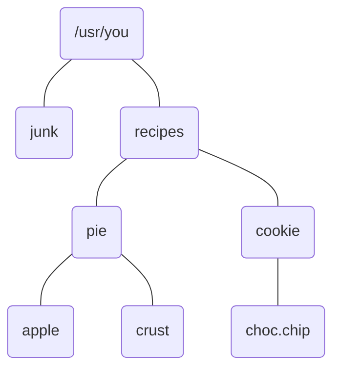

## Chapter 2: The File System

Everything in the UNIX system is a file.
That is less of an oversimplification than you might think.
When the first version of the system was being designed, before it even had a name, the discussions focused on the structure of a file system that would be clean and easy to use.
The file system is central to the success and convenience of the UNIX system.
It is one of the best examples of the "keep it simple" philosophy, showing the power achieved by careful implementation of a few well-chosen ideas.

To talk comfortably about commands and their interrelationships, we need a good background in the structure and outer workings of the file system.
This chapter covers most of the details of using the file system:
- what files are
- how they are represented
- directories and the file system hierarchy permissions
- inodes (the system's internal record of files)
- device files
Because most use of the UNIX system deals with manipulating files, there are many commands for file investigation or rearrangement; this chapter introduces the more commonly used ones.

### 2.1 The basics of files

A file is a sequence of bytes.
(A byte is a small chunk of information, typically 8 bits long. For our purposes, a byte is equivalent to a character.)
No structure is imposed on a file by the system, and no meaning is attached to its contents - the meaning of the bytes depends solely on the programs that interpret the file.
Furthermore, as we shall see, this is true not just of disc files but of peripheral devices as well.
Magnetic tapes, mail messages, characters typed on the keyboard, line printer output, data flowing in pipes - each of these files is just a sequence of bytes as far as the system and the programs in it are concerned.

The best way to learn about files is to play with them, so start by creating a small file:
```
$ ed
a
now is the time
for all good people
.
w junk
36
q
$ ls -l junk
-rw-r--r--  1  you     36 Sep 27 06:11 junk
$
```
`junk` is a file with 36 bytes - the 36 characters you typed while appending (except, of course, for correction of any typing mistakes).
To see the file,
```
$ cat junk
now is the time
for all good people
$ 
```
`cat` shows what the file looks like.
The command `od` (octal dump) prints a visible representation of all the bytes of a file:
```
$ od -c junk
0000000   n   o   w       i   s       t   h   e       t   i   m   e  \n
0000020   f   o   r       a   l   l       g   o   o   d       p   e   o
0000040   p   l   e  \n
0000044
$
```
The `-c` option means "interpret bytes as characters."
Turning on the `-b` option will show the bytes as octal (base 8) numbers as well:
```
$ od -cb junk
0000000   n   o   w       i   s       t   h   e       t   i   m   e  \n
        156 157 167 040 151 163 040 164 150 145 040 164 151 155 145 012
0000020   f   o   r       a   l   l       g   o   o   d       p   e   o
        146 157 162 040 141 154 154 040 147 157 157 144 040 160 145 157
0000040   p   l   e  \n
        160 154 145 012
0000044
$
```
The 7-digit numbers down the left side are positions in the file, that is, the ordinal number of the next character shown, in octal.
By the way, the emphasis on octal numbers is a holdover from the PDP-11, for which octal was the preferred notation.
Hexadecimal is better suited for other machines; the `-x` option tells `od` to print in hex.

Notice that there is a character after each line, with octal value `012`.
This is the ASCII *newline* character; it is what the system places in the input when you press the RETURN key.
By a convention borrowed from C, the character representation of a newline is `\n`, but this is only a convention used by programs like `od` to make it easy to read - the value stored in the file is the single byte `012`.

Newline is the most common example of a *special character*.
Other characters associated with some terminal control operation include backspace (octal value `010`, printed as `\b`), tab (`011`, `\t`), and a carriage return (`015`, `\r`).

It is important in each case to distinguish between how the character is stored in a file and how it is interpreted in various situations.
For example, when you type a backspace on your keyboard (and assuming that your erase character is backspace), the kernel interprets it to mean that you want to discard whatever character you typed previously.
Both that character and the backspace disappear, but the backspace is echoed to your terminal, where it makes the cursor move one position backwards.

If you type the sequence
```
\⌫
```
(i.e., `\` followed by a backspace), however, the kernel interprets that to mean that you want a literal backspace in your input, so the `\` is discarded and the byte `010` winds up in your file.
When the backspace is echoed on your terminal, it moves the cursor to sit on top of the `\`.
When you *print* a file that contains a backspace, the backspace is passed uninterpreted to your terminal, which again will move the cursor one position backwards.
When you use `od` to display a file that contains a backspace, it appears as a byte with value `010`, or, with the `-c` option, as `\b`.

The story for tabs is much the same: on input, a tab character is echoed to your terminal and sent to the program that is reading; on output, the tab is simply sent to the terminal for interpretation there.
There is a difference, though - you can tell the kernel that you want *it* to interpret tabs for you on output; in that case, each tab that would be printed is replaced by the right number of blanks to get to the next tab stop.
Tab stops are set a columns 9, 17, 25, etc.
The command
```
$ stty -tabs
```
causes tabs to be replaced by spaces *when printed on your terminal*.
See `stty`(1).

The treatment of RETURN is analogous.
The kernel echoes RETURN as a carriage return and a newline, but stores only the newline in the input.
On output, the newline is expanded into carriage return and newline.

The UNIX system is unusual in its approach to representing control information, particularly its use of newlines to terminate lines.
Many systems instead provide "records," one per line, each of which contains not only your data but also a count of the number of characters in the line (and no newline).
Other systems terminate each line with a carriage return *and* a newline, because that sequence is necessary for output on most terminals.
(The word "linefeed" is a synonym for newline, so this sequence is often called "CRLF", which is nearly pronounceable.)

The UNIX system does neither - there are no records, no record counts, and no bytes in any file that your programs did not put there.
A newline is expanded into a carriage return and a newline when sent to the terminal, but programs need only deal with the single newline character, because that is all they see.
For most purposes, this simple scheme is exactly what is wanted.
When a more complicated structure is needed, it can easily be build on top of this; the converse, creating simplicity from complexity, is harder to achieve.

Since the end of a line is marked by a newline character, you might expect a file to be terminated by another special character, say `\e` for "end of file."
Looking at the output of `od`, though, you will see no special character at the end of the file - it just stops.
Rather than using a special code, the system signifies the end of a file by simplify saying there is no more data in the file.
The kernel keeps track of file lengths, so a program encounters end-of-file when it has processed all the bytes in a file.

Programs retrieve the data in a file by a system call (a subroutine in the kernel) called `read`.
Each time `read` is called, it returns the next part of a file - the next line of text typed on the terminal, for example.
`read` also says how many bytes of the file were returned, so end of file is assumed when a `read` says "zero bytes are being returned."
If there were any bytes left, `read` would have returned some of them.
Actually, it makes sense not to represent end of file by a special byte value, because, as we said earlier, the meaning of the bytes depends on the interpretation of the file.
But *all* files must end, and since all files must be accessed through `read`, returning zero is an interpretation-independent way to represent the end of a file without introducing a new special character.

When a program reads from your terminal, each input line is given to the program by the kernel only when you type its newline (i.e, press RETURN).
Therefore if you make a typing mistake, you can back up and correct it if you realize the mistake before you type newline.
If you type newline before realizing the error, the line has been read by the system and you cannot correct it.

We can see how this line-at-a-time input works by using `cat`.
`cat` normally saves up or *buffers* its output to write in large chunks for efficiency, but `cat -u` "unbuffers" the output, so it is printed immediately as it is read:
```
$ cat
123
456
789
ctl-d
123
456
789
$ cat -u
123
123
456
456
789
789
ctl-d
$
```
`cat` receives each line when you press RETURN; without buffering, it prints the data as it is received.

Now try something different: type some characters and then a `ctl-d` rather than a RETURN:
```
$ cat -u
123ctl-d123
```
`cat` prints the characters out immediately.
`ctl-d` says, "immediately send the characters I have typed to the program that is reading from my terminal."
The `ctl-d` itself is not sent to the program, unlike a newline.
Now type a second `ctl-d` with no other characters:
```
$ cat -u
123ctl-d123ctl-d$
```
The shell responds with a prompt, because `cat` reads no characters, decided that meant end of file, and stopped.
`ctl-d` sends whatever you have typed to the program that is reading from the terminal.
If you haven't typed anything, the program will therefore read no characters, and that looks like the end of the file.
That is why typing `ctl-d` logs you out - the shell sees no more input.
Of course, `ctl-d` is usually used to signal an end-of-file but it is interesting that it has a more general function.

### 2.2 What's in a file

The format of a file is determined by the programs that use it; there is a wide variety of file types, perhaps because there is a wide variety of programs.
But since file types are not determined by the file system, the kernel can't tell you the type of a file: it doesn't know it.
The `file` command makes an educated guess (we'll explain how shortly):
```
$ file /bin /bin/ed /usr/src/cmd/ed.c /usr/man/man1/ed.1
/bin:	directory
/bin/ed:	pure executable
/usr/src/cmd/ed.c:	c program text
/usr/man/man1/ed.1:	roff, nroff, or eqn input text
$
```
These are four fairly typical files, all related to the editor:
- the directory in which it resides (`/bin`)
- the "binary" or runnable program itself (`/bin/ed`)
- the "source" or C statements that define the program (`/usr/src/cmd/ed.c`)
- the manual page (`/usr/man/man1/ed.1`)

To determine the types, `file` didn't pay attention to the names (although it could have), because naming conventions are just conventions, and thus not perfectly reliable.
For example, files suffixed `.c` are almost always C source, but there is nothing to prevent you from creating a `.c` file with arbitrary contents.
Instead, `file` reads the first few hundred bytes of a file and looks for clues to the file type.
(As we will show later on, files with special system properties, such as directories, can be identified by asking the system, but `file` could identify a directory by reading it.)

Sometimes the clues are obvious.
A runnable program is marked by a binary "magic number" at its beginning.
`od` with no options dumps the file in 16-bit, or 2-byte, words and makes the magic number visible:
```
$ od /bin/ed
...
$
```
The octal value `410` marks a pure executable program, one for which the executing code may be shared by several processes.
(Specific magic numbers are system dependent.)
The bit pattern represented by `410` is not ASCII text, so this value could not have been created inadvertently by a program like an editor.
But you could certainly create such a file by running a program of your own, and the system understands the convention that such files are program binaries.

For text files, the clues may be deeper in the file, so `file` looks for words like `#include` to identify C source, or lines beginning with a period to identify `nroff` or `troff` input.

You might wonder why the system doesn't track file types more carefully, so that, for example, `sort` is never given `/bin/ed` as input.
One reason is to avoid foreclosing some useful computation.
Although
```
$ sort /bin/ed
```
doesn't make much sense, there are many commands that can operate on any file at all, and there's no reason to restrict their capabilities.
`od`, `wc`, `cp`, `cmp`, `file`, and many others process files regardless of their contents.
But the formatless idea foes deeper than that.
If, say, `nroff` input were distinguished from C source, the editor would be forced to make the distinction when it created a file, and probably when it read in a file for editing again.
And it would certainly make it harder for us to typeset the C programs in Chapters 8 through 8!

Instead of creating distinctions, the UNIX system tries to efface them.
All text consists of lines terminated by newline characters, and most programs understand this simple format.
Many times while writing this book, we ran commands to create text files, processed them with commands like those listed above, and used an editor to merge them into the `troff` input for the book.
The transcripts you see on almost every page are made by commands like
```
$ od -c junk >temp
$ ed ch2.1
1534
r temp
168
...
```
`od` produces text on its standard output, which can then be used anywhere text can be used.
This uniformity is unusual; most systems have several file formats, even for text, and require negotiation by a program or a user to create a file of a particular type.
In UNIX systems there is just one kind of file, and all that is required to access a file is its name.

The lack of file formats is an advantage overall - programmers needn't worry about file types, and all the standard programs will work on any file - but there are a handful of drawbacks.
Programs that sort and search and edit really expect text as input: `grep` can't examine binary files correctly, nor can `sort` sort them, nor can any standard editor manipulate then.

There are implementation limitations with most programs that expect text as input.
We tested a number of programs on a 30,000 byte text file containing no newlines, and surprisingly few behaved properly, because most programs make unadvertised assumptions about the maximum length of a line of text (for an exception, see the BUGS section of `sort`(1)).

Non-text files definitely have their place.
For example, very large databases usually need extra address information for rapid access; this has to be binary for efficiency.
But every file format that is not text must have its own family of support programs to do things that the standard tools could perform if the format were text.
Text files may be a little less efficient in machine cycles, but this must be balanced against the cost of extra software to maintain more specialized formats.
If you design a file format, you should think carefully before choosing a non-textual representation.
(You should also think about making your programs robust in the face of long input lines.)

### 2.3 Directories and filenames

All of the files you own have unambiguous names, starting with `/usr/you`, but if the only file you have is `junk`, and you type `ls`, it doesn't print `/usr/you/junk`; the filename is printed without any prefix:
```
$ ls
junk
$
```
That is because each running program, that is, each process, has a *current directory*, and all filenames are implicitly assumed to start with the name of that directory, unless they begin directly with a slash.
Your login shell, and `ls`, therefore, have a current directory.
The command `pwd` (print working directory) identifies the current directory:
```
$ pwd
/usr/you
$
```

The current directory is an attribute of a process, not a person or a program - people have login directories, processes have current directories.
If a process creates a child process, the child inherits the current directory of its parent.
But if the child then changes to a new directory, the parent is unaffected - its current directory remains the same no matter that the child does.

The notion of having a current directory is certainly a notational convenience, because it can save a lot of typing, but its real purpose is organizational.
Related files belong together in the same directory.
`/usr` is often the top directory of the user file system.
(`user` is abbreviated to `usr` in the same spirit as `cmp`, `ls`, etc.)
`/usr/you` is your login directory, your current directory when you first log in.
`/usr/src` contains source for system programs, `/usr/src/cmd` contains source for UNIX commands, `/usr/src/cmd/sh` contains the source files for the shell, and so on.
Whenever you embark on a new project, or whenever you have a set of related files, say a set of recipes, you could create a new directory with `mkdir` and put the files there.
```
$ pwd
/usr/you
$ mkdir recipes
$ cd recipes
$ pwd
/usr/you/recipes
$ mkdir pie cookie
$ ed pie/apple
...
$ ed cookie/choc.chip
...
$
```
Notice that it is simple to refer to subdirectories.
`pie.apple` has an obvious meaning: the apple pie recipe, in directory `/usr/you/recipes/pie`.
You could instead have put the recipe in, say, `recipes/apple.pie`, rather than in a subdirectory of `recipes`, but it seems better organized to put all the pies together, too.
For example, the crust recipe could be kept in `recipes/pie/crust` rather than duplicating it in each pie recipe.

Although the file system is a powerful organizational tool, you can forget where you put a file, or even what files you've got.
The obvious solution is a command or two to rummage around directories.
The `ls` command is certainly helpful for finding files, but it doesn't look in sub-directories.
```
$ cd
$ ls
junk
recipes
$ file *
junk:	ascii text
recipes:	directory
$ ls recipes/pie
apple
crust
$
```
This piece of the file system can be shown pictorially as:


The command `du` (disc usage) was written to tell how much disc space is consumed by the files in a directory, including all its subdirectories.
```
$ du
6         ./recipes/pie
4         ./recipes/cookie
11        ./recipes
13        .
$
```
The filenames are obvious; the numbers are the number of disc blocks - typically 512 or 1024 bytes each - of storage for each file.
The value for a directory indicates how many blocks are consumed by all the files in that directory and its subdirectories, including the directory itself.

`du` has an option `-a`, for "all", that causes it to print out all the files in a directory.
If one of those is a directory, `du` processes that as well:
```
$ du -a
2       ./recipes/pie/apple
3       ./recipes/pie/crust
6       ./recipes/pie
3       ./recipes/cookie/choc.chip
4       ./recipes/cookie
11      ./recipes
1       ./junk
13      .
$
```

The output of `du -a` can be piped through `grep` to look for specific files:
```
$ du -a | crep choc
3       ./recipes/cookie/choc.chip
$
```
Recall from chapter 1 that the name `.` is a directory entry that refers to the directory itself; it permits access to a directory without having to know the full name.
`du` looks in a directory for files; if you don't tell it which directory, it assumes `.`, the directory you are in now.
Therefore, `junk` and `./junk` are names for the same file.

Despite their fundamental properties inside the kernel, directories sit in the file system as ordinary files.
They can be read as ordinary files.
But they can't be created or written as ordinary files - to preserve its sanity and the users' files, the kernel reserves to itself all control over the contents of directories.

The time has come to look at the bytes in a directory:
```
$ od -cb .
...
$
```

See the filenames buried in there?
The directory format is a combination of binary and textual data.
A directory consists of 16-byte chunks, the last 14 bytes of which hold the filename, padded with ASCII NUL's (which have value 0) and the first two of which tell the system where the administrative information for the file resides - we'll come back
to that.
Every directory begins with two entries `.` ("dot") and `..` ("dot-dot").
```
$ cd                Home
$ cd recipes
$ pwd
/usr/you/recipes
$ cd ..; pwd        Up one level
/usr/you
$ cd ..; pwd        Up another level
/usr
$ cd ..; pwd        Up another level
/
$ cd ..; pwd        Up another level
/                   Can't go any higher
$
```
The directory `/` is called the *root* of the file system.
Every file in the system is in the root directory or one of its subdirectories, and the root is its own parent directory.

### 2.4 Permissions

Every file has a set of *permissions* associated with it, which determine who can do what with the file.
If you're so organized that you keep your love letters on the system, perhaps hierarchically arranged in a directory, you probably don't want other people to be able to read them.
You could therefore change the permissions on each letter to frustrate gossip (or only on some of the letters, to encourage it), or you might just change the permissions on the directory containing the letters, and thwart snoopers that way.

But we must warn you: there is a special user on *every* UNIX system, called the *super-user*, who can read or modify *any* file on the system.
The special login name `root` carries super-user privileges; it is used by system administrators when they do system maintenance.
There us also a command called `su` that grants super-user status if you know the `root` password.
Thus anyone who knows the super-user password can read your love letters, so don't keep sensitive material in the file system.

If you need more privacy, you can change the data in a file so that even the super-user cannot read (or at least understand) it, using the `crypt` command (`crypt`(1)).
Of course, even `crypt` isn't perfectly secure.
A super-user can change the `crypt` command itself, and there are cryptographic attacks on the `crypt` algorithm.
The former requires malfeasance and the latter takes hard work, however, so `crypt` is in practice fairly secure.

In real life, most security breaches are due to passwords that are given away or easily guessed.
Occasionally, system administrative lapses make it possible for a malicious user to gain super-user permission.
Security issues are discussed further in some of the papers cited in the bibliography at the end of this chapter.

When you log in, you type a name and then verify that you are that person by typing a password.
The name is your login identification, or *login-id*.
But the system actually recognizes you by a number, called your user-id, or *uid*.
In fact different login-id's may have the same uid, making them indistinguishable to the system, although that is relatively rare and perhaps undesirable for security reasons.
Besides a uid, you are assigned a group identification, or *group-id*, which places you in a class of users.
On many systems, all ordinary users (as opposed to those with login-id's like `root`) are placed in a single group called `other`, but your system may be different.
The file system, and therefore the UNIX system in general, determines what you can do by the permissions granted to your uid and group-id.

The file `/etc/passwd` is the *password file*; it contains all the login information about each user.
You can discover your uid and group-id, as does the system, by looking up your name in `/etc/passwd`:
```
$ grep you /etc/passwd
you:gkmbCTrJ04COM:604:1:Y.O.A.People:/usr/you:
$
```
The fields in the password file are separated by colons and are laid out like this (as seen in `passwd`(5)):
```
login-id:encrypted-password:uid:group-id:miscellany:login-directory:shell
```
The file is ordinary text, but the field definitions and separator are a convention agreed upon by the programs that use the information in the file.

The shell field is often empty, implying that you use the default shell, `/bin/sh`.
The miscellany field may contain anything; often, it has your name and address or phone number.

Note that your password appears here in the second field, but only in an encrypted form.
Anybody can read the password file (you just did), so if your password itself were there, anyone would be able to use it to masquerade as you.
When you give your password to `login`, it encrypts it and compares the result against the encrypted password in `/etc/passwd`.
If they agree, it lets you log in.
The mechanism works because the encryption algorithm has the property that it's easy to go from the clear form to the encrypted form, but very hard to go backwards.
For example, if your password is `ka-boom`, it might be encrypted as `gkmbCTrJ04COM`, but given the latter, there's no easy way to get back to the original.

The kernel decided that you should be allowed to read `/etc/passwd` by looking at the permissions associated with the file.
There are three kinds of permissions for each file:
- read (examine its contents)
- write (change its contents)
- execute (run it as a program)
Furthermore, different permissions can apply to different people.
As file owner, you have one set of read, write, and execute permissions.
Your "group" has a separate set.
Everyone else has a third set.

The `-l` option of `ls` prints the permissions information, among other things:
```
$ ls -l /etc/passwd
-rw-r--r-- 1 root       5115 Aug 30 10:40 /etc/passwd
$ ls -lg /etc/passwd
-rw-r--r-- 1 adm        5115 Aug 30 10:40 /etc/passwd
$
```
These two lines may be collectively interpreted as: `/etc/passwd` is owned by login-id `root`, group `adm`, is 5115 bytes long, was last modified on August 30 at 10:40 AM, and has one link (one name in the file system; we'll discuss links in the next section).
Some versions of `ls` give both owner and group in one invocation.

The string `-rw-r--r--` is how `ls` represents the permissions on the file.
The first `-` indicates that it is an ordinary file.
If it were a directory, there would be `d` there.
The next three characters encode the file owner's (based on uid) read, write, and execute permissions.
`rw-` means that `root` (the owner) may read or write, but not execute the file.
An executable file would have an `x` instead of a dash.

The next three characters (`r--`) encode group permissions, in this case that people in group `adm`, presumably the system administrators, can read the file but not write or execute it.
The next three (also `r--`) define the permissions for everyone else - the rest of the users on the system.
On this machine, then, only `root` can change the login information for a user, but anybody may read the file to discover the information.
A plausible alternative would be for group `adm` to also have write permission on `/etc/passwd`.

The file `/etc/group` encodes group names and group-id's, and defines which users are in which groups.
`/etc/passwd` identifies only your login group; the `newgrp` command changes your group permissions to another group.

Anybody can say
```
$ ed /etc/passwd
```
and edit the password file, but only `root` can write back the changes.
You might therefore wonder how you can change your password, since it involves editing the password file.
The program to change passwords is called `passwd`; you will probably find it in `/bin`:
```
$ ls -l /bin/passwd
-rwsr-xr-x	1	root	8454	Jan	4	1983	/bin/passwd
$
```
(Note that `/etc/passwd` is the text file containing the login information, while `/bin/passwd`, in a different directory, is a file containing an executable program that lets you change the password information.)
The permissions state that anyone may execute the command, but only `root` can change the `passwd` command.
But the `s` instead of an `x` in the execute field for the file owner states that, when the command is run, it is to be given the permissions corresponding to the file owner, in this case `root`.
Because `/bin/passwd` is "set-uid" to `root`, any user can run the `passwd` command to edit the password file.

The set-uid bit is a simple but elegant idea that solves a number of security problems.
For example, the author of a game program can make the program set-uid to the owner, so that it can update a score file that is otherwise protected from other users' access.
But the set-uid concept is potentially dangerous.
`/bin/passwd` has to be correct; if it were not, it could destroy the system information under `root`'s' auspices.
If it had the permissions `-rwsrwxrwx`, it could be overwritten by *any* user, who could therefore replace the file with a program that does anything.
This is particularly serious for a set-uid program, because `root` has access permissions to every file on the system.
(Some UNIX systems turn the set-uid bit off whenever a file is modified, to reduce the danger of a security hole.)

The set-uid bit is powerful, but used primarily for a few system programs such as `passwd`.
Let's look at a more ordinary file.
```
$ ls -l /bin/who
-rwxrwxr-x	1	root	6348	Mar	29	1983	/bin/who
$
```
`who` is executable by everybody, and writable by `root` and the owner's group.
What executable "means" is this: when you type
```
$ who
```
to the shell, it looks in a set of directories, one of which is `/bin`, for a file named `who`.
If it finds such a file, and the file has execute permission, the shell calls the kernel to run it.
The kernel checks permissions, and, if they are valid, runs the program.
Note that a program is just a file with execute permission.
In the next chapter, we will show you programs that are just text files, but that can be executed as commands because they have execute permission set.

Directory permissions operate a little differently, but the basic idea is the same.
```
$ ls -ld .
drwxrwxr-x	3	you	80	Sep	27	06:11	.
$
```
The `-d` option of `ls` asks it to tell you about the directory itself, rather than its contents, and the leading `d` in the output signifies that `.` is indeed a directory.
An `r` field means that you can read the directory, so you can find out what files are in it with `ls` (or `od` for that matter).
A `w` means that you can create and delete files in this directory, because that requires modifying and therefore writing a directory file.

Actually, you cannot simply write in a directory -  even `root` is forbidden to do so.
```
$ who > .               Try to overwrite `.`
.: cannot create        You can't
$
```
Instead there are system calls that create and remove files, and only through them is it possible to change the contents of a directory.
The permissions idea, however, still applies: the `w` fields tell who can use the system routines to modify the directory.

Permission to remove a file is independent of the file itself.
If you have write permission in a directory, you may remove files there, even files that are protected against writing.
The `rm` command asks for confirmation before removing a protected file, however, to check that you really want to do so - one of the rare occasions that a UNIX program double-checks your intentions.
(The `-f` flag to `rm` forces it to remove files without question.)

The `x` field in the permissions on a directory does not mean execution; it means "search."
Execute permissions on a directory determines whether the directory may be searched for a file.
It is therefore possible to create a directory with the mode `--x` for other users, implying that users may access any file that they know about in that directory, but may not run `ls` on it or read it to see what files are there.
Similarly, with directory permissions `r--`, users can see (`ls`) but not use the contents of a directory.
Some installations use this device to turn off `/usr/games` during busy hours.

The `chmod` (change mode) command changes permissions on files.
```
$ chmod	permissions	filenames	...
```
The syntax of the *permissions* is clumsy however.
They can be specified in two ways, wither as octal numbers or by symbolic description.
The octal numbers are easier to use, although the symbolic descriptions are sometimes convenient because they can specify relative changes in permissions.
It would be nice if you could say
```
$ chmod rw-rw-rw- junk        Doesn't work this way!
```
rather than
```
$ chmod 666 junk
```
but you cannot.
The octal modes are specified by adding together:
- `4` for read
- `2` for write
- `1` for execute
The three digits specify, as in `ls`, permissions for the owner, group, and everyone else.
The symbolic codes are difficult to explain; you must look in `chmod`(1) for a proper description.
For our purposes, it is sufficient to note that `+` turns on a permission and that `-` turns if off.
For example
```
$ chmod +x command
```
allows everyone to execute `command`, and
```
$ chmod -w file
```
turns off write permission for everyone, including the file's owner.
Except for the usual disclaimer about super-users, only the owner of a file may change the permissions on a file, regardless of the permissions themeselves.
Even if somebody else allows you to write a file, the system will not allow you to change its permissions bits.
```
$ ls -ld /usr/mary
drwxrwxrwx	5	mary	704	Sep	25	10:18	/usr/mary
$ chmod 444 /usr/mary
chmod: can't change /usr/mary
$
```
If a directory is writable, however, people can remove files in it regardless of the permissions on the files themselves.
If you want to make sure that you or your friends never delete files from a directory, remove write permission from it:
```
$ cd
$ date > temp
$ chmod -w .
$ ls -ld .
dr-xr-xr-x	3	you	80	Sep	27	11:48	.
$ rm temp
rm: temp not removed
$ chmod 775 .
$ ls -ld .
dr-xr-xr-x	3	you	80	Sep	27	11:48	.
$ rm temp
$
```
`temp` is now gone.
Notice that changing the permissions on the directory didn't change it's modification date.
The modification date reflects changes to the file's contents, not its modes.
The permissions and dates are not stored in the file itself, but in a system structure called an index node, or *i-node*, the subject of the next section.

### 2.5 Inodes

### 2.6 The directory hierarchy

In Chapter 1, we looked at the file system hierarchy rather informally, starting from `/usr/you`.
We're now going to investigate it in a more orderly way, starting from the top of the tree, the root.
The top directory is `/`.
```
$ ls /
bin
boot
dev
etc
lib
tmp
unix
usr
$ 
```
`/unix` is the program for the UNIX kernel itself: when the system starts, `/unix` is read from disk into memory and started.
Actually, the process occurs in two steps: first the file `/boot` is read; it then reads in `/unix`.
More information about this "bootstrap" process may be found in `boot`(8).
The rest of the files in `/`, at least here, are directories, each a somewhat self-contained section of the total file system.
In the following brief tour of the hierarchy, play along with the text: explore a bit in the directories mentioned.
The more familiar you are with the layout of the file system, the more effectively you will be able to use it.
Table 2.1 suggests good places to look, although some of the names are system dependent.

| directory          | description                                        |
|--------------------|----------------------------------------------------|
| `/`                | root of the file system                            |
| `/bin`             | essential programs in executable form ("binaries") |
| `/dev`             | device files                                       |
| `/etc`             | system miscellany                                  |
| `/etc/motd`        | login message of the day                           |
| `/etc/passwd`      | password file                                      |
| `/lib`             | essential libraries, etc.                          |
| `/tmp`             | temporary files; cleaned when system is restarted  |
| `/unix`            | executable form of the operating system            |
| `/usr`             | user file system                                   |
| `/usr/adm`         | system administration: accounting info., etc.      |
| `/usr/bin`         | user binaries: `troff`, etc.                       |
| `/usr/dict`        | dictionary (`words`) and support for `spell`(1)    |
| `/usr/games`       | game programs                                      |
| `/usr/include`     | header files for C programs, e.g. `math.h`         |
| `/usr/include/sys` | system header files for C programs, e.g. `inode.h` |
| `/usr/lib`         | libraries for C, FORTRAN, etc.                     |
| `/usr/man`         | on-line manual                                     |
| `/usr/man/man1`    | manual pages for section 1 of manual               |
| `/usr/mdec`        | hardware diagnostics, bootstrap programs, etc.     |
| `/usr/news`        | community service messages                         |
| `/usr/pub`         | public oddments: see `ascii`(7) and `eqnchar`(7)   |
| `/usr/src`         | source code for utilities and binaries             |
| `/usr/src/cmd`     | source for commands in `/bin` and `/usr/bin`       |
| `/usr/src/lib`     | source code for subroutine libraries               |
| `/usr/spool`       | working directories for communications programs    |
| `/usr/spool/lpd`   | line printer temporary directory                   |
| `/usr/spool/mail`  | mail in-boxes                                      |
| `/usr/spool/uucp`  | working directory for the `uucp` programs          |
| `/usr/sys`         | source code for the operating system kernel        |
| `/usr/tmp`         | alternate temporary directory (little used)        |
| `/usr/you`         | your login directory                               |
| `/usr/you/bin`     | your personal programs                             |


`/bin` (binaries) we have seen before: it is the directory where the basic programs such as `who` and `ed` reside.

`/dev` (devices) we will discuss in the next section

`etc` (*et cetera*) we have also seen before.
It contains various administrative files such as the password file and some system programs such as `/etc/gettty` which initializes a terminal connection for `/bin/login`.
`/etc/rc` is a file of shell commands that is executed after the system is bootstrapped.
`/etc/group` lists the members of each group.

`/lib` (library) contains primarily parts of the C compiler, such as `/lib/cpp`, the C preprocessor, and `/lib/libc.a`, the C subroutine library.

`/tmp` (temporaries) is a repository for short-lived files created during the execution of a program.
When you start up the editor `ed`, for example, it creates a file with a name like `/tmp/e00512` to hold its copy of the file you are editing, rather than working with the original file.
It could, of course, create the file in your current directory, but there are advantages to placing it in `/tmp`: although it is unlikely, you might already have a file called `e00512` in your directory; `/tmp` is cleaned automatically when the system starts so your directory doesn't get an unwanted file if the system crashes; and often `/tmp` is arranged on the disc for fast access.

There is a problem, of course, when several programs create files in `/tmp` at once: they might interfere with each other's files.
That is why `ed`'s temporary file has a peculiar name: it is constructed in such a way as to guarantee that no other program will choose the same name for its temporary file.
In Chapters 5 and 6 we will see ways to do this.

`/usr` is called the "user file system," although it may have little to do with the actual users of the system.
On our machine, our login directories are `/usr/bwk` and `/usr/rob`, but on your machine the `/usr` part might be different, as explained in Chapter 1.
Whether or not your personal files are in a subdirectory of `/usr`, there are a number of things you are likely to find there (although local customs may vary in this regard too).
Just as in `/`, there are directories called `/usr/bin`, `/usr/lib`, and `/usr/tmp`.
These directories have functions similar to their namesakes in `/`, but contain programs less critical to the system.
For example, `nroff` is usually in `/usr/bin` rather than `/bin`, and the FORTRAN compiler libraries live in `/usr/lib`.
Of course, just what is deemed "critical" varies from system to system.
Some systems, such as the distributed 7th Edition, have all the programs in `/bin` and do away with `/usr/bin` altogether; others split `/usr/bin` into two directories according to frequency of use.

Other directories in `/usr` are `/usr/adm`, containing accounting information and `/usr/dict`, which holds a modest dictionary (see `spell`(1)).
The on-line manual is kept in `/usr/man` - see `/usr/man/man1/spell.1` for example.
If your system has source code on-line, you will probably find it in `/usr/src`.

It is worth spending a little time exploring the file system, especially `/usr`, to develop a feeling for how the file system is organized and where you might expect to find things.

### 2.7 Devices

We skipped over `/dev` in our tour, because the files there provide a nice review of files in general.
As you might guess from the name, `/dev` contains device files.

One of the prettiest ideas in the UNIX system is the way it deals with `peripherals` - discs, tape drives, line printers, terminals, etc.
Rather than having special system routines to, for example, read magnetic tape, there is a file called `/dev/mt0` (again, local customs may vary).
Inside the kernel, references to that file are converted into hardware commands to access the tape, so if a program reads `/dev/mt0`, the contents of the tape mounted on the drive are returned.
For example,
```
$ cp /dev/mt0 junk
```
copies the contents of the tape to a file called `junk`.
`cp` has no idea there is anything special about `/dev/mt0`; it is just is file - a sequence of bytes.

The device files are something of a zoo, each creature a little different, but the basic ideas of the file system apply to each.
Here is a significantly shortened list of our `/dev`
```
$ ls -l /dev
crw--w--w-	1	root     0,   0 Sep	27	23:09	console
crw-r--r--	1	root     3,   1 Sep	27	23:09	kmem
crw-r--r--	1	root     3,   0 Sep	27	23:09	mem
brw-rw-rw-	1	root     1,  64 Sep	27	23:09	mt0
crw-rw-rw-	1	root     3,   2 Sep	27	23:09	null
crw-rw-rw-	1	root     4,  64 Sep	27	23:09	rmt0
brw-r-----	1	root     2,   0 Sep	27	23:09	rp00
brw-r-----	1	root     2,   1 Sep	27	23:09	rp01
crw-r-----	1	root     13,  0 Sep	27	23:09	rrp00
crw-r-----	1	root     13,  1 Sep	27	23:09	rrp01
crw-rw-rw-	1	root     2,   0 Sep	27	23:09	tty
crw--w--w-	1	you      1,   0 Sep	27	23:09	tty0
crw--w--w-	1	root     1,   1 Sep	27	23:09	tty1
crw--w--w-	1	root     1,   2 Sep	27	23:09	tty2
crw--w--w-	1	root     1,   3 Sep	27	23:09	tty3
$
```
The first things to notice are that instead of a byte count there is a pair of small integers, and that the first character of the mode is always a `b` or a `c`.
This is how `ls` prints the information from an inode that specifies a device rather than a regular file.
The inode of a regular file contains a list of disc blocks that store the file's contents.
For a device file, the inode instead contains the internal name for the device, which consists of its type - *character* (`c`) or *bloc* (`b`) - and a pair of numbers, called the *major* and *minor* device numbers.
Discs and tapes are block devices; everything else - terminals, printers, phone lines, etc. - is a character device.
The major number encodes the type of device, while the minor number distinguishes different instances of the device.
For example, `/dev/tty0` and `/dev/tty1` are two ports on the same terminal controller, so they have the same major device number but different minor numbers.

Disc files are usually named after the particular hardware variant they represent.
`/dev/rp00` and `/dev/rp01` are named after the DEV RP06 disc drive attached to the system.
There is just one drive, divided logically into two file systems.
If there were a second drive, its associated files would be named `/dev/rp10` and `/dev/rp11`.
The first digit specifies the physical drive, and the second which portion of the drive.

You might wonder why there are several disc device files, instead of just one.
For historical reasons and for ease of maintenance, the file system is divided into smaller subsystems.
The files in a subsystem are accessible through a directory in the main system.
The program `/etc/mount` reports the correspondence between device files and directories:
```
$ /etc/mount
rp01 on /usr
$
```
In our case, the root system occupies `/dev/rp00` (although this isn't reported by `/etc/mount`) while the user file system - the files in `/usr` and its subdirectories - reside on `/dev/rp01`.

The root file system has to be present for the system to execute.
`/bin`, `/dev`, and `/etc` are always kept on the root system, because when the system starts only files in the root system are accessible, and some files such as `/bin/sh` are needed to run at all.
During the bootstrap operation, all the file systems are checked for self-consistency (see `icheck`(8) or `fsck`(8)), and attached to the root system.
The attachment operation is called mounting, the software equivalent of mounting a new disc pack in the drive; it can normally be done only by the super-user.
After `/dev/rp01` has been mounted as `/usr`, the files in the user file system are accessible exactly as if they were part of the root system.

For the average user, the details of which file subsystem is mounted where are of little interest, but there are a couple of relevant points.
First, because the subsystem may be mounted and dismounted, it is illegal to make a link to a file in another subsystem.
For example, it is impossible to link programs in `/bin` to convenient names in private `bin` directories, because `/usr` is in a different file subsystem from `/bin`:
```
$ ln /bin/mail /usr/you/bin/m
ln: Cross-device link
$
```
There would also be a problem because inode numbers are not quite unique in different file systems.

Second, each subsystem has fixed upper limits on size (number of blocks available for files) and inodes.
If a subsystem fills up, it will be impossible to enlarge files in that subsystem until some space is reclaimed.
The `df` (disc free space) command reports the available space on the mounted file systems:
```
$ df
/dev/rp00 1989
/dev/rp01 21257
$
```
`/usr` has 21257 free blocks.
Where this is ample space or a crisis depends on how the system is used; some installations need more file space headroom than others.
By the way, of all of the commands, `df` probably has the widest variation in output format.
Your `df` output may look quite different.

Let's turn now to some more generally useful things.
When you log in, you get a terminal line and therefore a file in `/dev` through which the characters you type and receive are sent.
The `tty` command tells you which terminal you are using:
```
$ whoami
you      tty0      Sep 28 01:02
$ tty
/dev/tty0
$ ls -l /dev/tty0
crw--w--w- 1 you      1, 12 Sep 28 02:40 /dev/tty0
$ date > dev/tty0
Wed Sep 28 02:40:51 EDT 1983
$
```
Notice that you own the device, and that only you are permitted to read it.
In other words, no one else can directly read the characters you are typing.
Anyone may write on your terminal, however.
To prevent this, you could `chmod` the device, thereby preventing people from using `write` to contact you, or you could just use `mesg`.
```
$ mesg n            Turn off messages
$ ls -l /dev/tty0
crw------- 1 you      1, 12 Sep 28 02:40 /dev/tty0
$ mesg y            Restore
```

It's often useful to be able to refer by name to the terminal you are using, but it's inconvenient to determine which one it is.
The device `/dev/tty` is a synonym for your login terminal, whatever terminal you are actually using.
```
$ date > /dev/tty
Wed Sep 28 02:42:23 EDT 1983
$
```
`/dev/tty` is particularly useful when a program needs to interact with a user even though its standard input and output are connected to files rather than the terminal.
`crypt` is one program that uses `/dev/tty`.
The "clear text" comes from the standard input, and the encrypted data goes to the standard output, so `crypt` reads the encryption key from `/dev/tty`.
```
$ crypt < cleartext > cryptedtext
Enter key:                          Type encryption key
$
```
The use of `/dev/tty` isn't explicit in this example, but it is there.
If `crypt` read the key from the standard input, it would read the first line of the clear text.
So instead `crypt` opens `/dev/tty`, turns off automatic character echoing so your encryption key doesn't appear on the screen, and reads the key.
In Chapters 5 and 6 we will come across several other uses of `/dev/tty`.

Occasionally you want to run a program but don't care what output is produced.
For example, you may have already seen today's news, and don't want to read it again.
Redirecting `news` to the file `/dev/null` causes its output to be thrown away:
```
$ news > /dev/null
$
```
Data written to `/dev/null` is discarded without comment, while programs that read from `/dev/null` get end-of-file immediately, because reads from `/dev/null` always return zero bytes.

One common use of `/dev/null` is to throw away regular output so that diagnostic messages are visible.
For example, the `time` command (`time`(1)) reports the CUP usage of a program.
The information is printed on the standard error, so you can time commands that generate copious output by sending the standard output to `/dev/null`:
```
$ ls -l /usr/dict/words
-r--r--r-- 1 bin    196513 Jan 20  1979 /usr/dict/words
$ time grep e /usr/dict/words > /dev/null

real       13.0
user        9.0
sys         2.7
$ time egrep e /usr/dict/words > /dev/null

real        8.0
user        3.9
sys         2.6
$
```
The numbers in the output of `time` are elapsed clock time, CPU time spent in the program and CPU time spent in the kernel while the program was running.
`egrep` is a high-powered variant of `grep` that we will discuss in Chapter 4; it's about twice as fast as `grep` when searching through large files.
If output from `grep` and `egrep` had not been sent to `/dev/null` or a real file, we would have had to wait for hundreds of thousands of characters to appear on the terminal before finding out the timing information we were after.

